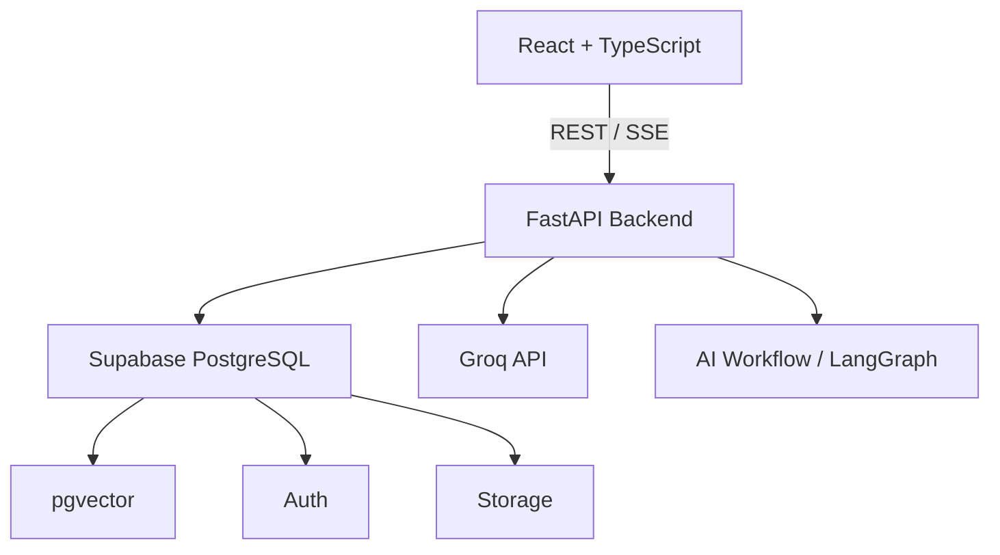

# Architecture

## High-Level Architecture

## Frontend
- React (Client-side)
- TypeScript
- Vite
- React Router
- Tailwind CSS
- shadcn/ui
- TanStack Query
- React Hook Form
- Zod
- Recharts
- Monaco Editor

## Backend
- Python
- FastAPI
- Pydantic
- SQLAlchemy (where appropriate)
- Supabase Python client
- Groq API (LLM provider)
- LangGraph
- PyMuPDF/pdfplumber
- pytest

## Infrastructure
- Supabase (PostgreSQL, pgvector, Auth, Storage)

## Core Principles
- Deterministic logic where possible. LLM is not the source of truth for user identity, permissions, interview state, database records, scoring formulas.
- Clear separation between frontend, backend, AI logic, and database.
