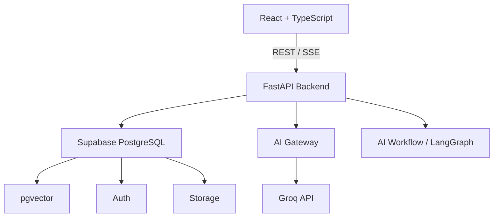
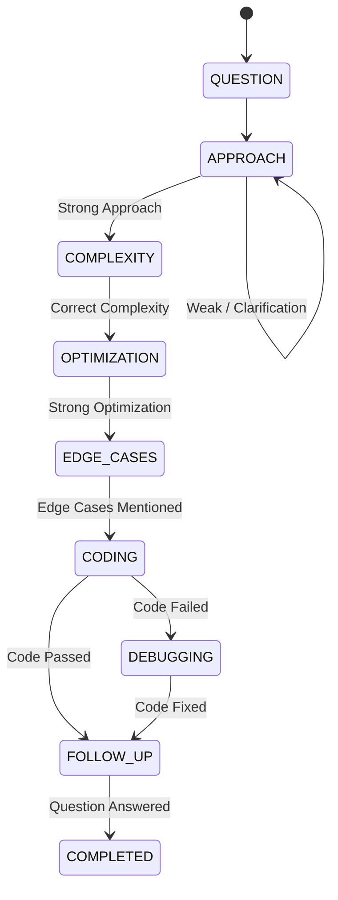

# Architecture

## High-Level Architecture

## Frontend
- React (Client-side)
- TypeScript
- Vite
- React Router
- Tailwind CSS
- shadcn/ui
- TanStack Query
- React Hook Form
- Zod
- Recharts
- Monaco Editor

## Backend
- Python
- FastAPI
- Pydantic
- SQLAlchemy (where appropriate)
- Supabase Python client
- AI Gateway Pattern (Groq Provider)
- LangGraph (Stateful Interview Orchestration)
- PyMuPDF/pdfplumber
- pytest

## Infrastructure
- Supabase (PostgreSQL, pgvector, Auth, Storage)

## Core Principles
- Deterministic logic where possible. LLM is not the source of truth for user identity, permissions, interview state, database records, scoring formulas.
- Clear separation between frontend, backend, AI logic, and database.

## Stateful AI Interviewer (LangGraph)
The AI Interviewer operates on a LangGraph state machine rather than stateless chat looping.
The graph dictates exactly how the interview flows and when transitions are allowed.

### LangGraph Workflow
1. **Observe (LLM)**: Analyzes the candidate's latest message based on the current stage and produces a structured `CandidateAnalysis` (intent, approach quality, correctness, etc.).
2. **Decide (Deterministic Python)**: A rigid state machine evaluates the `CandidateAnalysis` against the `current_stage`. It decides whether the candidate successfully fulfilled the stage requirements and outputs the `next_stage` and `next_action`.
3. **Generate (LLM)**: Crafts the natural-language response executing the `next_action` requested by the state machine.

### Stage Transitions

### State Persistence
The graph state is transient during the request. Critical state values (`current_stage`, `candidate_approach`, `hints_used`, `mistakes`) are persisted to the `interview_sessions` table at the end of the request. The state is dynamically reconstructed from the database when the candidate sends the next message.

## Execution Sandbox
The code execution engine is completely isolated from the main FastAPI host. Candidate code is treated as malicious by default.

### Docker Runner Strategy
* **Isolation**: Executed in a disposable \python:3.11-slim\ container.
* **Limits**: RAM restricted to 256MB. CPU restricted to 1.
* **Network**: Disabled completely via \--network none\.
* **Filesystem**: Candidate code only has access to a transient workspace mounted dynamically per run.
* **Orchestration**: Managed strictly through backend endpoints (e.g. \POST /api/interviews/execute\).

### Separation of Execution and Evaluation
The sandbox solely runs assertions and produces a deterministic \ExecutionResult\. The LLM's role is restricted to parsing why the execution failed conceptually and coaching the candidate. The LLM does **not** evaluate correctness nor gate state transitions directly; that is governed by the Python LangGraph router reading the trusted execution payload.

## Evaluation Engine
The evaluation engine converts raw interview transcripts and objective sandbox state into a persisted structured report (\InterviewEvaluationResponse\).

### Separation of Concerns
- **Backend State**: Enforces \hints_used\, \mistakes\, and the exact \ExecutionResult\ from the Docker sandbox.
- **LLM**: Parses the transcript purely to extract qualitative insights (strengths, actionable recommendations, and explicit structured weaknesses).
- **Evaluation Logic**: Python code applies deterministic weights (e.g., deducting points per hint/mistake, ratio of passed tests) to produce an authoritative \overall_score\ (0-100) and \inal_outcome\ (\PASSED\, \NEEDS_IMPROVEMENT\, \INCOMPLETE\).

### Persistence
The calculated evaluation dictionary is stored in the \interview_sessions.evaluation_data\ JSONB column. Future \GET /api/interviews/{session_id}/evaluation\ calls return this cached payload, guaranteeing stability and preventing LLM cost overrun.

